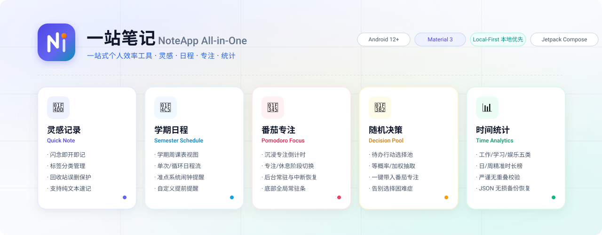

<p align="center">
  <picture>
    <source media="(prefers-color-scheme: dark)" srcset="docs/assets/banner-dark.svg">
    <source media="(prefers-color-scheme: light)" srcset="docs/assets/banner-light.svg">
    
  </picture>
</p>

<p align="center">
  
  
  
  
  
</p>

# 一站笔记 (NoteApp All-in-One)

一站笔记是一款按 MVP 里程碑开发的 Android 个人效率应用，将**灵感记录**、**学期日程**、**番茄专注**、**随机决策**和**时间统计**深度融合在一个轻量、纯粹、本地优先的工具中。

> 当前状态：M8 的单元测试、Lint、Debug/Release 构建和 API 35 模拟器仪器测试已通过。API 31 最低版本兼容、实体手机系统行为和用户 keystore 签名仍是正式交付前置条件，完成前只提供 Debug 验收包，不宣称 Release 已交付。

## 常用命令

```bash
# 运行单元测试
./gradlew test

# 编译并在已连接的模拟器或设备上运行 Room/DataStore 仪器测试
./gradlew connectedDebugAndroidTest

# 执行 Lint 静态检查
./gradlew lint

# 构建 Debug APK
./gradlew assembleDebug

# 构建未签名 Release APK；签名交付见 M8 发布验收指南
./gradlew assembleRelease
```

## 核心能力

以下 MVP 核心业务流程已经可用：

- 已实现：打开应用后快速记录想法，用简单标签整理，并通过回收站恢复误删内容。
- 已实现：通过日程顶部时期按钮管理学期并查看当天学期周次或寒暑假状态，使用课表式周视图或横向事件视图查看计划。
- 已实现：使用纯粹的番茄钟专注计时工具，支持暂停、继续、重置、提前结束、阶段确认与重启恢复。
- 已实现：为课程和普通事件提供可逐项关闭或调整提前分钟数的准点提醒，并明确显示权限不足状态。
- 已实现：为事件池项目配置 `1–100` 权重，通过彩色大转盘按权重抽取一件事，可再次旋转或把名称带入番茄钟。
- 已实现：手动录入、回溯修改或永久删除实际时间记录，拒绝无效范围和重叠记录。
- 已实现：将实际时间归入“工作、学习、高质量娱乐、低质量娱乐、社交”五类，通过事件性质排行榜或事件名称排行榜查看日、周统计。
- 已实现：按设备当前时区和真实自然日长度计算未记录的“其他”时间；“其他”不是用户可选事件性质，也不进入排行榜。
- 已实现：通过系统文件选择器手动导入、导出带 `formatVersion = 1` 的 UTF-8 明文 JSON；导入先完整校验，再经确认整体替换。

## 目标用户

适合希望用一个本地、低门槛工具完成记录、安排和时间复盘的个人用户，尤其适合不想在多个笔记、日历、计时器应用之间切换的人。

## M3 最小示例

前置条件是使用 API 31 或更高版本设备安装 Debug APK。进入底栏“日程”，点击顶部“未设置学期”按钮，新增 `2026` 秋季学期并填写 `2026-09-01` 至 `2027-01-15`；再打开“课程”新增周一 `08:00—09:30`、第 `1—10` 周的课程。当天落在学期内时，顶部按钮显示标准学期名称和当前周次；否则按已配置学期显示“寒假中”或“暑假中”。返回课表并切到对应周，预期课程显示名称、地点、时间和“学习”；切换到“事件流”时只显示本周尚未结束的实例。日程卡片仅提供只读详情与编辑跳转，不会生成 `TimeRecord`。

日期采用 `YYYY-MM-DD`，时间采用 `HH:mm`。重叠配置会要求确认但允许保存；启用提醒后，只有通知权限与“闹钟和提醒”权限都已授予，页面才显示提醒已生效。

## M4 最小示例

前置条件是使用 API 31 或更高版本设备安装 Debug APK；Android 13 或更高版本还会使用运行时通知权限。进入底栏“设置”，确认“通知权限”和“闹钟和提醒权限”均显示“已授权”。再到底栏“日程”新增一个开始时间晚于当前时间 10 分钟的单次普通事件，保持提醒开启并填写提前 `5` 分钟。

保存后，配置列表应显示“提醒：提前 5 分钟（已生效）”，系统应在事件开始前约 5 分钟显示通知。如果提醒时间已经过去但事件尚未开始，保存后会立即提醒一次；事件已经开始则不会补发。修改、停用或删除日程后，旧提醒会被取消；循环日程每次只调度下一实例，触发后再补充下一次。

可用 `./gradlew testDebugUnitTest` 验证调度计算和同步规则，用 `./gradlew assembleDebugAndroidTest` 编译权限状态界面测试。通知准点性、拒绝或撤销权限、设备重启、时区变化和厂商省电策略必须在实体 Android 12 或更高版本手机上执行 `./gradlew connectedDebugAndroidTest` 并人工复核。

## M5 最小示例

前置条件是使用 API 31 或更高版本设备安装 Debug APK；Android 13 或更高版本需要在首次开始专注时确认通知权限，拒绝权限不会阻止计时，但后台阶段结束通知无法显示。进入底栏“工具箱”，在“事件池与抽奖”新增权重为 `1` 的“阅读”和权重为 `3` 的“写作”。预期转盘分别显示 `25.0%` 和 `75.0%` 扇区；点击“抽一下”后转盘减速停到中选扇区，结果卡片与指针一致。停用“写作”后再次抽取只能得到“阅读”；点击“带入番茄钟”只会填写事项名称，不会覆盖计时时长。

把专注/休息设置为 `1/1` 分钟并开始专注。运行中可以暂停、继续、重置或经确认提前结束；离开页面后，主要页面底部显示紧凑状态条。专注完成后必须手动点击“开始休息”，休息完成后也不会自动开始下一轮。重新打开应用时，运行阶段按绝对截止时间恢复；若截止时间已过，只显示完成状态，不补发过期通知。整个流程不会创建 `TimeRecord`。

可用 `./gradlew testDebugUnitTest` 验证加权抽取、转盘几何、状态机和协调层，用 `./gradlew assembleDebugAndroidTest` 编译 Room 迁移、权重表单、Compose 与系统 Intent 测试。转盘动画观感、后台通知、进程终止、设备重启和厂商省电策略仍必须在实体 Android 12 或更高版本手机上人工复核。

## M6 最小示例

前置条件是使用 API 31 或更高版本设备安装 Debug APK。进入底栏“日程”，切换到“时间统计”视图，保持“日”和“按事件性质”，点击“手动录入”，填写名称 `写作`、性质“工作”、开始 `2026-08-25 09:00`、结束 `2026-08-25 11:00`；再录入名称 `阅读`、性质“学习”、时间 `2026-08-25 14:00—15:30`。预期榜单依次显示“工作 2小时”“学习 1小时30分钟”，未记录时间为 `20小时30分钟`。切到“按事件名称”应显示同样的精确时长，不显示百分比或图表。

记录允许回溯和跨日期，但结束必须晚于开始，且不能与现有记录覆盖同一实际时间片段；首尾相邻可以保存。编辑后统计立即重算，删除必须确认“永久删除后无法恢复”，删除某名称的最后一条记录后，该名称也会从快捷选项消失。周视图按周一至周日汇总并列出每日记录与未记录时长；跨时区后会按设备当前时区重新归日。

可用 `./gradlew testDebugUnitTest` 验证跨午夜裁剪、榜单排序、日周状态和夏令时 23/25 小时自然日，用 `./gradlew assembleDebugAndroidTest` 编译 Room 与 Compose 测试。连接 API 31 或更高版本设备后执行 `./gradlew connectedDebugAndroidTest`，再人工复核新增、编辑、重叠失败、永久删除和应用重启后的数据。

## M7 最小示例

前置条件是使用 API 31 或更高版本设备安装 Debug APK，且番茄钟不处于运行或暂停状态。进入底栏“设置”，点击“导出 JSON 备份”，阅读明文个人数据提示并选择可信保存位置；成功后页面会提示目标文件名。备份包含六类业务实体、回收站灵感和 `AppSettings`，不包含活动番茄钟、通知或闹钟权限、密钥及设备路径。

验证恢复时可先新增一条容易辨认的灵感并导出，再修改该灵感；点击“导入 JSON 备份”选择刚导出的文件。应用先校验 `formatVersion`、字段、标识、引用和业务范围，再显示各类数据数量。确认“替换全部现有数据”后，原业务数据和设置会被备份内容整体替换，到期回收站灵感会被清理，日程提醒按当前系统权限重建。未知版本、损坏字段、悬空引用或重叠时间记录只显示失败反馈，不修改现有数据。

可用 `./gradlew testDebugUnitTest` 验证 JSON 往返、完整校验、活动计时防护和失败补偿，用 `./gradlew assembleDebugAndroidTest` 编译 Room 事务与设置页测试。连接设备后执行 `./gradlew connectedDebugAndroidTest`，再人工复核系统文件选择器、明文提示、取消操作、整体替换和导入后提醒。

## 技术基线

- 原生 Android：Kotlin、Jetpack Compose 和 Material 3。
- `applicationId` 为 `com.yuncun.noteapp`，最低支持 Android 12（API 31）。
- `compileSdk` 与 `targetSdk` 当前均使用 API 35；项目统一通过 Gradle Wrapper 构建，不依赖全局 Gradle。
- 本地数据使用 Room 和 DataStore，导航与状态管理使用 Navigation Compose、ViewModel 和 Coroutines，JSON 备份使用 kotlinx.serialization。
- MVP 只适配手机竖屏，提供跟随系统的浅色与深色主题。
- 首版交付用户自行保管密钥签名的本地 APK，不接入应用商店、账号或云同步。

技术选型的背景与取舍见[采用原生 Android 技术栈](docs/adr/0001-采用原生Android技术栈.md)。
## 开发环境

使用 Android Studio 稳定版、JDK 17 或 JDK 21 和 Android SDK。当前 Gradle 与 Android Gradle Plugin 组合不支持 JDK 25。项目已内置 Gradle Wrapper，直接使用 `./gradlew` 构建与测试，无需安装全局 Gradle。

模拟器验收至少需要安装一个 Android 12（API 31）或更高版本的系统镜像并创建 AVD；后台计时、通知和省电策略还必须在 Android 12 或更高版本的实体手机上验证。

## 文档导航

- [产品需求文档](docs/product/产品需求文档.md)：产品目标、功能规则、范围和验收标准。
- [页面与交互说明](docs/product/页面与交互说明.md)：页面结构、主要操作路径和状态反馈。
- [数据模型与统计口径草案](docs/reference/数据模型与统计口径.md)：核心数据、提醒、备份和时间计算规则。
- [品牌与视觉设计规范](docs/reference/品牌设计规范.md)：品牌定位、色彩体系、5大模块视觉符号与 Banner 规范。
- [代码测试规范](docs/reference/代码测试规范.md)：代码测试分层、用例设计、执行门禁和结果记录要求。
- [MVP 执行计划与验证指南](docs/how-to/MVP实施与验证指南.md)：从工程初始化到 APK 交付的里程碑、任务依赖、阶段出口和验证门禁。
- [M8 发布验收与 APK 签名](docs/how-to/M8发布验收与APK签名.md)：启动 AVD、执行全量门禁、人工验收、签名和故障排查。
- [采用原生 Android 技术栈](docs/adr/0001-采用原生Android技术栈.md)：已确认的工程技术决策及影响。

## MVP 边界

首个版本按单用户、单设备、本地优先设计，不包含账号体系、云同步、多人协作、桌面端或复杂提醒。应用只提供番茄钟阶段结束提醒，以及课程默认提前 25 分钟、普通事件默认提前 5 分钟的本地提醒。

## 文档使用方式

后续开始 vibe coding 前，以产品需求文档的“已确认 MVP 决策”和技术栈 ADR 为实现基线。每完成一个模块，应同步实现对应验收标准，并保持本文档描述与应用真实行为一致。
